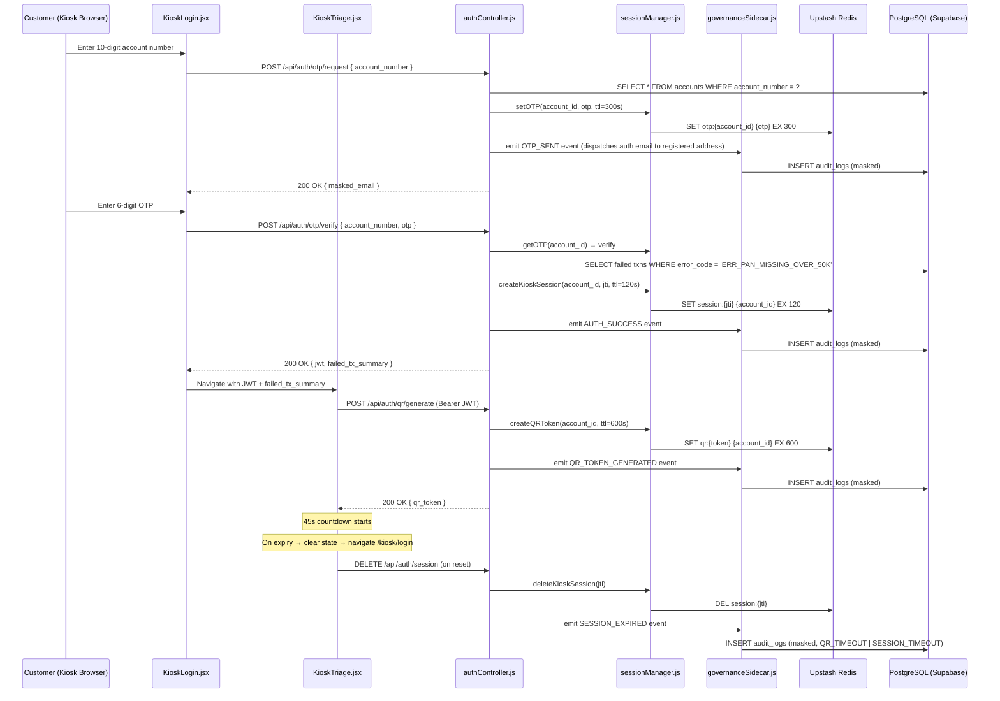

# Design Document — Domain 1: Auth & Triage

## Overview

Domain 1 is the entry boundary of the Autonomous Branch Operations & Compliance Engine. It covers two sequential kiosk screens — **KioskLogin** (numeric keypad + OTP) and **KioskTriage** (proactive diagnosis + QR handoff) — plus all backend logic that supports them.

The design goal is to authenticate a branch customer with a two-factor challenge (account number + email OTP), immediately surface any blocking compliance event (`ERR_PAN_MISSING_OVER_50K`) using a proactive CBS ledger lookup, and hand off the remediation workflow to the customer's own mobile device via a time-limited, encrypted QR token — all within a hard 2-minute kiosk session window and with every state transition captured in an immutable, PII-safe audit log.

### Key Design Decisions

| Decision | Rationale |
|---|---|
| All ephemeral state in Upstash Redis | Supports stateless horizontal scaling; no in-process `Map`/`Set` objects ever hold session data |
| OTP lockout via Redis counter | Prevents brute-force without requiring a DB write per attempt; TTL auto-clears the counter |
| JWT `jti` as Redis session key | Allows O(1) session invalidation without scanning all keys |
| Governance Sidecar as pure middleware | Primary auth response is never blocked by audit failures; retries are background |
| QR token as URL-safe base64 (≥32 bytes) | 256-bit entropy makes token guessing computationally infeasible |
| 45-second QR countdown + 120-second hard ceiling | Twin guard: countdown communicates urgency to customer; Redis TTL enforces it server-side |

---

## Architecture

The domain follows the project's API Gateway pattern. The React frontend communicates exclusively with the Node.js backend via REST; no cloud SDK is imported client-side.



### Subsystem Responsibilities

| Subsystem | File(s) | Responsibility |
|---|---|---|
| Kiosk Auth UI | `KioskLogin.jsx` | Numeric keypad, masked display, OTP input, error rendering |
| Kiosk Triage UI | `KioskTriage.jsx` | Proactive diagnosis card, Voice Visualiser, QR canvas, countdown timer, auto-reset |
| Auth Controller | `authController.js` | Request validation, CBS lookup, JWT issuance, QR token generation |
| Session Manager | `sessionManager.js` | All Redis read/write for OTP, kiosk session, QR token TTLs |
| Governance Sidecar | `governanceSidecar.js` | PII redaction, `audit_logs` insert, retry with exponential backoff |
| Redis Client | `redisClient.js` | Upstash REST client wrapper; exports `set`, `get`, `del`, `ttl`, and `incrWithExpiry` (INCR+EXPIRE pipeline); all Redis calls must go through here |
| DB Index | `db/index.js` | Supabase PostgreSQL connection pool via `postgres.js` driver; exports `query` (tagged-template SQL); configured from `SUPABASE_DB_URL` env var; max 10 connections, SSL required |

---

## Components and Interfaces

### Frontend Components

#### `KioskLogin.jsx`

**Props:** none (standalone page)

**Local state:**
```
accountNumber: string          // max 10 digits, numeric only
otpValue: string               // max 6 digits
phase: 'ACCOUNT' | 'OTP'       // controls which input is active
maskedDigits: boolean[]        // tracks which positions have been masked (500ms delay)
error: string | null           // ERR_ACCOUNT_NOT_FOUND | ERR_OTP_INVALID | ERR_OTP_LOCKED | ERR_OTP_EXPIRED
```

**Key behaviours:**
- Keypad `onKeyPress` filters non-numeric input before updating state (Req 1.4)
- `maskDigitAfterDelay(index)` — sets `maskedDigits[index] = true` after 500 ms (Req 1.2)
- Enables "Send OTP" only when `accountNumber.length === 10` (Req 1.3)
- On successful OTP verify: stores JWT in `sessionStorage` (never `localStorage`), navigates to `/kiosk/triage` passing `failed_tx_summary` via React Router `state`

#### `KioskTriage.jsx`

**Props:** `location.state.failedTxSummary`, `location.state.jwt`

**Local state:**
```
countdown: number              // starts at 45, counts down to 0
qrToken: string | null         // URL-safe base64 token
sessionExpired: boolean        // triggers redirect when true
voiceActive: boolean           // drives Voice Visualiser animation
```

**Key behaviours:**
- On mount: calls `POST /api/auth/qr/generate`, starts 45-second `setInterval`
- `useEffect` on every render cycle: validates JWT against Redis via `GET /api/auth/session/validate` (Req 7.1)
- Countdown at ≤10s: renders timer value in `#2563eb` accent (Req 10.5)
- On countdown zero OR session invalidation: calls `resetKiosk()` which clears state, removes JWT from `sessionStorage`, navigates to `/kiosk/login` (Req 6.2, 7.2)
- On `beforeunload` / route-change: triggers same reset sequence (Req 6.6)
- `Voice_Visualiser` animates when `voiceActive === true` and TTS is playing (Req 4.4)

#### Shared Neo-Bento Utilities

All keypad buttons: `shadow-[8px_8px_16px_#cbced1,-8px_-8px_16px_#ffffff]` resting, `shadow-[inset_4px_4px_8px_#cbced1,inset_-4px_-4px_8px_#ffffff]` pressed (Req 10.1)

QR hero cell: `col-span-1 md:col-span-2 lg:col-span-2 row-span-2` (Req 10.2)

Grid spacing: `gap-6` or `gap-8` between all Bento cells (Req 10.3)

Focus indicators: `focus-visible:ring-2 focus-visible:ring-blue-600` on all interactive elements (Req 10.6)

---

### Backend API Contracts

#### `POST /api/auth/otp/request`
```
Request body:  { account_number: string }
Success:       200 { masked_email: string }   // e.g. "j***@example.com"
Errors:        404 { error: "ERR_ACCOUNT_NOT_FOUND" }
SLA:           ≤ 2000ms (Req 2.6)
```

#### `POST /api/auth/otp/verify`
```
Request body:  { account_number: string, otp: string }
Success:       200 { jwt: string, failed_tx_summary: FailedTxSummary | null }
Errors:        401 { error: "ERR_OTP_INVALID" | "ERR_OTP_LOCKED" | "ERR_OTP_EXPIRED" }
SLA:           CBS lookup ≤ 1500ms (Req 4.6)
```

#### `POST /api/auth/qr/generate`
```
Headers:       Authorization: Bearer <kiosk_jwt>
Success:       200 { qr_token: string, deep_link_url: string }
Errors:        401 { error: "ERR_SESSION_EXPIRED" }
```

#### `GET /api/auth/session/validate`
```
Headers:       Authorization: Bearer <kiosk_jwt>
Success:       200 { valid: true }
Errors:        401 { error: "ERR_SESSION_EXPIRED" }
```

#### `DELETE /api/auth/session`
```
Headers:       Authorization: Bearer <kiosk_jwt>
Body:          { reason: "QR_TIMEOUT" | "SESSION_TIMEOUT" | "MANUAL_NAVIGATE" }
Success:       204 No Content
```

---

### `redisClient.js` Interface

```javascript
// All modules must use these wrappers — never import @upstash/redis directly.
set(key: string, value: string | number | object, options?: { ex?: number }): Promise<string>
get(key: string): Promise<string | null>
del(...keys: string[]): Promise<number>          // returns count of keys deleted
ttl(key: string): Promise<number>               // -2 if missing, -1 if no expiry
incrWithExpiry(key: string, ex: number): Promise<number>  // INCR + EXPIRE pipeline; returns new count
```

Initialised from `REDIS_URL` and `REDIS_TOKEN` environment variables; throws at startup if either is absent.

---

### `sessionManager.js` Interface

```javascript
// OTP lifecycle
setOTP(accountId: string, otp: string): Promise<void>        // EX 300s
getOTP(accountId: string): Promise<string | null>
deleteOTP(accountId: string): Promise<void>

// OTP lockout
incrementOTPAttempts(accountId: string): Promise<number>     // EX 300s, returns new count
lockOTPEntry(accountId: string): Promise<void>               // EX 300s
isOTPLocked(accountId: string): Promise<boolean>

// Kiosk session
createKioskSession(accountId: string, jti: string): Promise<void>  // EX 120s
getKioskSession(jti: string): Promise<string | null>               // returns accountId
deleteKioskSession(jti: string): Promise<void>

// QR token
createQRToken(token: string, accountId: string): Promise<void>     // EX 600s
consumeQRToken(token: string): Promise<string | null>              // returns accountId, then DEL
```

All Redis keys follow namespaced patterns:
- `otp:{account_id}` — OTP value
- `otp:attempts:{account_id}` — attempt counter
- `otp:locked:{account_id}` — lock sentinel
- `session:{jti}` — kiosk session
- `qr:{token}` — QR token

---

### `governanceSidecar.js` Interface

```javascript
// Called by authController for every state transition.
// Returns void — NOT a Promise. Always call fire-and-forget; never await.
emitAuthEvent(eventType: AuditEventType, payload: object, actorId?: string | null): void

// AuditEventType values (Req 9.1):
// OTP_SENT | OTP_VERIFIED | OTP_FAILED | OTP_LOCKED
// SESSION_CREATED | SESSION_EXPIRED | QR_TOKEN_GENERATED | TX_BLOCKED_PAN_MISSING | AUTH_SUCCESS
// DOCUMENT_UPLOADED | TICKET_APPROVED | TICKET_REJECTED

// Exported helpers (also used by property tests):
redactPAN(payload: object): object            // deep-clones then masks [A-Z]{5}\d{4}[A-Z] → XXXXX-1234-X
redactAccountNumber(payload: object): object  // deep-clones then masks \b\d{10}\b → last 4 digits
redactPayload(payload: object): object        // applies both redactions in sequence (PAN then account number)
insertAuditLog(record: AuditLogRecord): Promise<void>  // INSERT with 3-retry exponential backoff (100/200/400 ms)
```

The sidecar is invoked **after** the primary response is sent (fire-and-forget pattern) so audit failures never block the customer-facing response (Req 9.5).

---

## Data Models

### PostgreSQL Tables (existing schema)

The `accounts` table is the source of truth for customer identity and PAN link status:

```sql
-- Key columns used by this domain
accounts.id               UUID    -- used as account_id in JWT claims
accounts.account_number   VARCHAR(10) UNIQUE  -- lookup key for OTP request
accounts.email            VARCHAR(255) UNIQUE  -- destination for OTP dispatch; masked_email in response
accounts.pan_linked       BOOLEAN -- gate for ERR_PAN_MISSING_OVER_50K
accounts.pan_number       VARCHAR(10)         -- masked in all audit trails
```

The `transactions` table stores the CBS ledger — queried during proactive diagnosis:

```sql
-- This table must exist (created in 001_initial_schema.sql migration)
CREATE TABLE transactions (
    id UUID PRIMARY KEY DEFAULT gen_random_uuid(),
    account_id UUID REFERENCES accounts(id),
    amount DECIMAL(12,2) NOT NULL,
    error_code VARCHAR(50) NULL,       -- 'ERR_PAN_MISSING_OVER_50K' when blocked
    created_at TIMESTAMP WITH TIME ZONE DEFAULT CURRENT_TIMESTAMP
);
```

The `audit_logs` table receives one row per state transition from the Governance Sidecar:

```sql
-- Existing schema (from Dbscheme-postgres.txt)
audit_logs.event_type        VARCHAR(50)   -- e.g. 'AUTH_SUCCESS', 'SESSION_EXPIRED'
audit_logs.payload_snapshot  JSONB         -- PII-redacted snapshot
audit_logs.actor_id          UUID NULL     -- account UUID, null for pre-auth events
audit_logs.created_at        TIMESTAMP WITH TIME ZONE
```

### Redis Key Schema

| Key Pattern | Value | TTL | Purpose |
|---|---|---|---|
| `otp:{account_id}` | 6-digit numeric string | 300s | OTP for verification |
| `otp:attempts:{account_id}` | integer string | 300s | Failed attempt counter |
| `otp:locked:{account_id}` | `"1"` sentinel | 300s | Lockout flag |
| `session:{jti}` | account_id UUID string | 120s | Kiosk session binding |
| `qr:{token}` | account_id UUID string | 600s | Single-use QR token |

### JWT Payload Schema

```json
{
  "sub": "<account_id UUID>",
  "account_number": "<last 4 digits only>",
  "role": "CUSTOMER",
  "jti": "<UUID v4 — used as Redis session key>",
  "iat": 1700000000,
  "exp": 1700000120
}
```

> Note: The full account number is never embedded in the JWT. Only the last 4 digits are carried as `account_number` for display purposes.

### TypeScript Interfaces (Frontend / Shared)

```typescript
interface FailedTxSummary {
  count: number;
  most_recent_amount: number;      // e.g. 75000.00
  most_recent_created_at: string;  // ISO 8601
}

interface OTPRequestResponse {
  masked_email: string;            // e.g. "j***@example.com"
}

interface OTPVerifyResponse {
  jwt: string;
  failed_tx_summary: FailedTxSummary | null;
}

interface QRGenerateResponse {
  qr_token: string;
  deep_link_url: string;           // https://<domain>/mobile/<token>
}

interface AuditLogRecord {
  event_type: string;
  payload_snapshot: object;
  actor_id: string | null;
}
```

---

## Correctness Properties

*A property is a characteristic or behavior that should hold true across all valid executions of a system — essentially, a formal statement about what the system should do. Properties serve as the bridge between human-readable specifications and machine-verifiable correctness guarantees.*

### Property 1: OTP attempt counter increments monotonically until lockout

*For any* account and any sequence of N consecutive failed OTP submissions (where 1 ≤ N ≤ 3), the Redis attempt counter for that account SHALL equal exactly N after N failures, and when N = 3 the account's OTP entry SHALL be locked such that `isOTPLocked()` returns `true`.

**Validates: Requirements 3.3, 3.4**

---

### Property 2: Redis TTL fidelity for all ephemeral keys

*For any* accountId, jti, or QR token value, the TTL set on their respective Redis keys by the Session Manager SHALL be within [TTL - 1, TTL] seconds of the configured value at the moment of creation: OTP keys at 300 seconds, kiosk session keys at 120 seconds, and QR token keys at 600 seconds.

**Validates: Requirements 2.4, 3.6, 5.2**

---

### Property 3: QR token is single-use (non-replayable)

*For any* generated QR token, after the first call to `consumeQRToken()` returns the associated `account_id`, all subsequent calls to `consumeQRToken()` with that same token SHALL return `null`, preventing session replay.

**Validates: Requirements 5.6**

---

### Property 4: Failed transaction diagnosis is account-scoped and time-bounded

*For any* set of transaction records with varying `account_id`, `error_code`, and `created_at` values, the `failed_tx_summary` count returned by the Auth Controller SHALL equal exactly the number of records where `account_id` matches the authenticated account AND `error_code = 'ERR_PAN_MISSING_OVER_50K'` AND `created_at` is within the last 24 hours — records outside this filter SHALL never be counted.

**Validates: Requirements 4.1, 4.2**

---

### Property 5: PAN threshold rule is a strict Boolean boundary

*For any* transaction with any `amount` and any `pan_linked` status, the error code `ERR_PAN_MISSING_OVER_50K` SHALL be assigned if and only if `amount > 50000` AND `pan_linked = false`. Transactions where `amount ≤ 50000` SHALL never receive this error code regardless of `pan_linked` status; transactions where `pan_linked = true` SHALL never receive it regardless of `amount`.

**Validates: Requirements 8.1, 8.2**

---

### Property 6: Audit log payload is free of all unmasked PII

*For any* event payload passed to the Governance Sidecar containing any PAN-like string (matching the pattern `[A-Z]{5}\d{4}[A-Z]`) or any 10-digit account number string, the `payload_snapshot` written to `audit_logs` SHALL contain no unmasked PAN values (all must appear as `XXXXX-1234-X`) and no full account number strings (all must appear as their last 4 digits only).

**Validates: Requirements 9.2, 9.3**

---

### Property 7: Redis session deletion is the authoritative authentication gate

*For any* kiosk session JWT where the corresponding Redis key (`session:{jti}`) has been deleted or has expired, every subsequent request to any Auth Controller endpoint carrying that JWT SHALL be rejected with HTTP 401 and `ERR_SESSION_EXPIRED` — the JWT's own `exp` claim SHALL NOT be sufficient to grant access in the absence of the Redis record.

**Validates: Requirements 7.3, 7.4**

---

### Property 8: Every auth state transition produces exactly one audit log entry

*For any* valid `AuditEventType` (OTP_SENT, OTP_VERIFIED, OTP_FAILED, OTP_LOCKED, SESSION_CREATED, SESSION_EXPIRED, QR_TOKEN_GENERATED, TX_BLOCKED_PAN_MISSING, AUTH_SUCCESS), a single call to `emitAuthEvent()` SHALL result in exactly one `INSERT` being executed against `audit_logs` — never zero, never more than one per event.

**Validates: Requirements 9.1**

---

### Property 9: Numeric keypad rejects all non-numeric input without side effects

*For any* string input containing at least one non-numeric character, processing that input through the KioskLogin keypad logic SHALL leave the account number state completely unchanged — the length SHALL not increase, and no non-numeric character SHALL ever appear in the account number field.

**Validates: Requirements 1.4**

---

### Property 10: Countdown timer threshold drives accent color

*For any* countdown value between 0 and 45 (inclusive), the KioskTriage countdown display SHALL apply the `#2563eb` accent color class if and only if the value is less than or equal to 10, and SHALL use the standard primary text color for all values greater than 10.

**Validates: Requirements 10.5**

---

## Error Handling

### Frontend Error States

| Error Code | Screen | User-Visible Message | Recovery Action |
|---|---|---|---|
| `ERR_ACCOUNT_NOT_FOUND` | KioskLogin | "Account number not found. Please check and retry." | Clears input, re-enables keypad |
| `ERR_OTP_INVALID` | KioskLogin | "Incorrect OTP. X attempts remaining." | Shows remaining attempts |
| `ERR_OTP_LOCKED` | KioskLogin | "Too many attempts. Please try again in 5 minutes." | Disables OTP input for 300s |
| `ERR_OTP_EXPIRED` | KioskLogin | "OTP has expired. Please request a new one." | Returns to account entry phase |
| `ERR_SESSION_EXPIRED` | KioskTriage | (silent) — triggers immediate reset to KioskLogin | Auto-redirect |
| Network / 5xx | Both | "Service unavailable. Please see a teller." | Shows teller-redirect card |

### Backend Error Handling

**OTP Request flow:**
1. `accounts` lookup failure (network) → 503, do not generate OTP
2. OTP delivery failure (email service down) → 503 `ERR_OTP_DELIVERY_FAILED`, log to application error log
3. Redis write failure → 503 `ERR_SESSION_STORE_UNAVAILABLE`; never issue OTP if it cannot be stored

**OTP Verify flow:**
1. Redis unavailable → 503; fail closed (do not allow authentication without verified Redis state)
2. Attempt counter Redis write failure → proceed with verification but log warning; do not block auth

**Session Reset flow:**
1. Redis DEL failure on session cleanup → log error; frontend state is still cleared (defense in depth)
2. Audit log insert failure → retry 3× with exponential backoff (100ms, 200ms, 400ms), then write to application error log; **never block primary response**

**CBS Ledger Lookup (proactive diagnosis):**
1. Query timeout (>1500ms) → return `failed_tx_summary: null` and log timeout; kiosk shows general welcome without blocking auth
2. PostgreSQL connection failure → same as timeout: degrade gracefully, do not block JWT issuance

### Security Error Handling

- All 401 responses include only the error code string — no stack traces, no internal details
- Lockout state is checked **before** OTP comparison to prevent timing-based enumeration
- JWT signature verification failure always returns 401 with no detail (cannot distinguish expired vs tampered)

---

## Testing Strategy

### Unit Tests (`/tests/api`, `/tests/cache`)

Focus on specific examples, edge cases, and error conditions:

- `authController.js`: OTP request with unknown account number → `ERR_ACCOUNT_NOT_FOUND`
- `authController.js`: CBS lookup returns correct subset (only last-24h, only `ERR_PAN_MISSING_OVER_50K`)
- `authController.js`: Transaction amount = 50000 → no `ERR_PAN_MISSING_OVER_50K` recorded (boundary)
- `authController.js`: Transaction amount = 50001 → `ERR_PAN_MISSING_OVER_50K` recorded (boundary)
- `sessionManager.js`: `consumeQRToken` — second call returns `null`
- `sessionManager.js`: OTP TTL is set to exactly 300 on `setOTP`
- `governanceSidecar.js`: Raw PAN string `"ABCDE1234F"` in payload → masked to `"XXXXX-1234-X"`
- `governanceSidecar.js`: Full account number in payload → masked to last 4 digits

### Property-Based Tests (`/tests/api`, `/tests/cache`, `/tests/frontend`)

Using **fast-check** (JavaScript property-based testing library). Each test runs **minimum 100 iterations**.

**Feature: domain-1-auth-triage, Property 1: OTP attempt counter increments monotonically until lockout**
- Generator: random `accountId` UUIDs, integer N in [1, 3]
- Assert: after N failed OTP attempts, `incrementOTPAttempts()` returns N; after N=3, `isOTPLocked()` returns `true`

**Feature: domain-1-auth-triage, Property 2: Redis TTL fidelity for all ephemeral keys**
- Generator: random `accountId` UUIDs, `jti` UUIDs, URL-safe base64 token strings
- Assert: after `setOTP()`, Redis TTL ∈ [299, 300]; after `createKioskSession()`, TTL ∈ [119, 120]; after `createQRToken()`, TTL ∈ [599, 600]. Use mock Redis to inspect SET EX arguments directly.

**Feature: domain-1-auth-triage, Property 3: QR token is single-use**
- Generator: random URL-safe base64 tokens (≥32 bytes), random `accountId` UUIDs
- Assert: `consumeQRToken(token)` first call returns `accountId`, second call returns `null`

**Feature: domain-1-auth-triage, Property 4: Failed tx diagnosis is account-scoped and time-bounded**
- Generator: random arrays of transaction records with varying `account_id`, `error_code` values, and `created_at` timestamps (mix of within/outside 24h window)
- Assert: the summary count equals exactly the count of records satisfying all three filter conditions simultaneously

**Feature: domain-1-auth-triage, Property 5: PAN threshold rule is a strict Boolean boundary**
- Generator: random `amount` values in range [0, 200000] (including boundary values 50000, 50001), random `pan_linked` boolean
- Assert: `shouldBlockTransaction(amount, panLinked)` returns `true` iff `amount > 50000 && !panLinked`; returns `false` for all other combinations

**Feature: domain-1-auth-triage, Property 6: Audit log payload is free of all unmasked PII**
- Generator: random nested payload objects containing random PAN-like strings (matching `[A-Z]{5}\d{4}[A-Z]`) and 10-digit account number strings embedded at arbitrary depths
- Assert: after `redactPayload(payload)`, `JSON.stringify(result)` matches neither the unmasked PAN regex nor a 10-digit numeric string at any depth

**Feature: domain-1-auth-triage, Property 7: Redis session deletion is the authoritative authentication gate**
- Generator: random `jti` UUIDs and `accountId` UUIDs
- Assert: after `deleteKioskSession(jti)`, `getKioskSession(jti)` returns `null`; mock Express middleware should reject any request whose `jti` is absent from Redis with 401

**Feature: domain-1-auth-triage, Property 8: Every auth state transition produces exactly one audit log entry**
- Generator: random valid `AuditEventType` values drawn from the full enum, random actor UUIDs and payload objects
- Assert: `emitAuthEvent(type, payload)` results in exactly one mock `INSERT` call to `audit_logs`; never 0 or more than 1

**Feature: domain-1-auth-triage, Property 9: Numeric keypad rejects all non-numeric input without side effects**
- Generator: random strings containing at least one non-numeric character (letters, symbols, punctuation, unicode)
- Assert: after processing each character through the keypad `onKeyPress` handler, the account number state is unchanged (same length, no non-numeric characters present)

**Feature: domain-1-auth-triage, Property 10: Countdown timer threshold drives accent color**
- Generator: integer countdown values in range [0, 45]
- Assert: the rendered countdown element has the `text-blue-600` / `#2563eb` class iff countdown ≤ 10; uses standard text color class for all values > 10

### Frontend Component Tests (`/tests/frontend`)

Using **React Testing Library + Vitest**:

- `KioskLogin`: Non-numeric key press is silently ignored (Req 1.4)
- `KioskLogin`: "Send OTP" button disabled when `accountNumber.length < 10`, enabled at exactly 10 (Req 1.3)
- `KioskLogin`: Digit masked after 500ms (use fake timers) (Req 1.2)
- `KioskTriage`: Countdown timer renders in `#2563eb` when value ≤ 10 (Req 10.5)
- `KioskTriage`: Navigates to `/kiosk/login` when countdown reaches 0 (Req 6.2)
- `KioskTriage`: Proactive diagnosis card renders when `failedTxSummary` is non-null (Req 4.3)
- `KioskTriage`: General welcome screen renders when `failedTxSummary` is null (Req 4.5)

### Integration Tests (`/tests/e2e`)

Full flow with a real Redis instance (Upstash test environment) and Supabase staging database:

- Happy path: account entry → OTP delivery → OTP verify → QR generation → 45s countdown → auto-reset
- Lockout path: 3 consecutive wrong OTPs → `ERR_OTP_LOCKED` → account locked for 300s
- Session expiry path: wait 120s → subsequent session validate call → `ERR_SESSION_EXPIRED` → frontend redirects
- Proactive diagnosis path: seed account with `ERR_PAN_MISSING_OVER_50K` transaction within 24h → verify `failed_tx_summary` in response
- Audit trail path: complete auth flow → verify all expected `audit_logs` rows exist with masked PII
