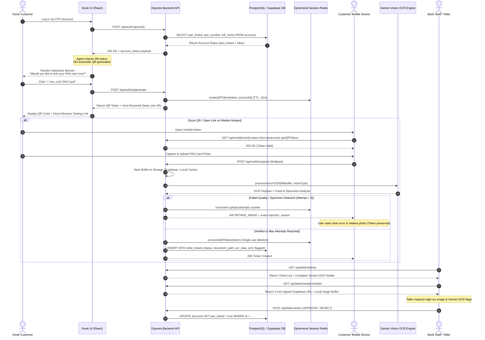

# Comprehensive Implementation Plan: Torii Hardened Gemini OCR & HITL Verification Pipeline

This document serves as the master architectural specification and execution record for integrating the **Google Gen AI (@google/genai) Multimodal Compliance Engine** into the **Torii Self-Service Kiosk**, **Mobile PWA Handoff**, and **Teller Human-in-the-Loop (HITL) Workstation**.

> [!IMPORTANT]
> **Zero-Trust Verification Policy**: Document confidence scores from AI models must never bypass hard compliance guardrails. Any image containing specimen/dummy indicators, fingerprint obstructions, scribbles, or severe blur is strictly rejected with a `RETAKE_IMAGE` directive before reaching the teller queue.

> [!NOTE]
> All components listed below have been implemented, integrated, and verified against unit and integration test suites.

---

## 1. End-to-End System Architecture



---

## 2. Core Subsystems & Technical Requirements

### A. Database-Driven Agent Triage & Interactive Consent
1. **Database Truth**: The backend inspects the actual `accounts` table in PostgreSQL/Supabase during OTP verification (`verifyOTP` in `authController.js`).
2. **No Auto-QR**: Kiosk does **not** auto-generate a QR code upon login.
3. **Interactive Choice**: `KioskTriage.jsx` displays an interactive prompt asking: *"Would you like to link your PAN card now?"* with two options:
   - `⚡ Yes, Link PAN Card` -> Triggers `/api/auth/qr/generate`.
   - `Not Now` -> Dismisses prompt.

### B. Dynamic Host Resolution & Hotspot Testing Support
1. **Network Independence**: `generateQRToken` in `authController.js` constructs `deepLinkUrl` dynamically from `req.headers.host` and `x-forwarded-proto`, ensuring mobile devices connected via Mobile Hotspot or Wi-Fi can open the URL.
2. **Direct Link Fallback**: `KioskTriage.jsx` displays a **"📱 Open Link in Browser"** anchor and **"Copy URL"** button for instant computer/browser testing without a physical camera.

### C. Gemini Multimodal Anti-Fraud Engine
1. **Official Gen AI SDK**: Uses `@google/genai` (`gemini-flash-latest`).
2. **Deterministic Heuristics**:
   - `fixPanHeuristics()` fixes alphanumeric confusions (e.g. `O` -> `0`, `l` -> `1`).
   - `maskAadhaarPrivacy()` automatically masks 12-digit Aadhaar numbers (`XXXX-XXXX-1234`).
   - `evaluateEdgeCasesAndSpecimens()` detects specimen/dummy data (`AAAAA0000A`, `XXXXXX`), hand/finger obstructions, and scribbles.
3. **Non-Destructive Token Lifecycles**: `sessionManager.js` provides `getQRToken()` for token verification. The token is only destroyed via `consumeQRToken()` once a ticket is successfully created or attempt limits are reached.

### D. Supabase Storage Persistence & Teller Inspection
1. **Dual Storage Handler (`storageService.js`)**: Uploads files to Supabase Storage bucket `pan-documents`. In local development without Supabase keys, caches image buffers in `localImageStore` and serves them as base64 data URLs.
2. **Teller Image Viewer (`SecureImageDisplay.jsx`)**: Renders the exact document image with zoom controls (80%–250%).
3. **Gemini Bento Box (`Dashboard.jsx`)**: Showcases Extracted Name, PAN, ID Type, DOB, Vision Confidence %, Name Match Score %, Tampering Status, Specimen Flag, and Rejection Reasons to the human teller.

---

## 3. Implementation Matrix

| File Path | Functional Responsibility | Status |
| :--- | :--- | :--- |
| `backend/src/cache/sessionManager.js` | Added `getQRToken` non-destructive inspection helper alongside `consumeQRToken`. | ✅ Verified |
| `backend/src/controllers/authController.js` | Updated `verifyOTP` to return DB `account_status` and `generateQRToken` to use dynamic host header resolution. | ✅ Verified |
| `backend/src/controllers/mobileController.js` | Preserved QR tokens on retry attempts (`attempt < 3`), added anti-fraud details to `RETAKE_IMAGE` responses. | ✅ Verified |
| `backend/src/services/storageService.js` | Added `localImageStore` buffer cache for local dev teller inspection fallback. | ✅ Verified |
| `backend/src/controllers/tellerController.js` | Formatted pending tickets query to include full `ocr_data`, `document_path`, and `name_mismatch_score`. | ✅ Verified |
| `frontend/src/pages/kiosk/KioskLogin.jsx` | Updated OTP navigation state to include `accountStatus`. | ✅ Verified |
| `frontend/src/pages/kiosk/KioskTriage.jsx` | Removed auto-QR generation, added interactive consent prompt and direct testing link buttons. | ✅ Verified |
| `frontend/src/pages/mobile/DocumentUpload.jsx` | Enhanced error handling to render specific anti-fraud rejection messages on retries. | ✅ Verified |
| `frontend/src/pages/teller/Dashboard.jsx` | Expanded Gemini Vision OCR Verification Bento Box to display all extracted compliance fields. | ✅ Verified |
| `frontend/src/pages/teller/SecureImageDisplay.jsx` | Rendered uploaded document image with zoom controls and 5-min signed URL TTL. | ✅ Verified |

---

## 4. Verification & Testing Instructions

### Automated Unit Tests
To verify all AI vision heuristics, mobile routes, and sandbox reset mechanisms, run:
```bash
npx vitest run tests/ai/visionAgent.test.js tests/sandbox/resetEngine.test.js
```

### Manual Integration Test Protocol
1. **Kiosk Login**: Log into the kiosk at `http://localhost:3000/kiosk/login` using test account `1000000001` and OTP `123456`.
2. **Interactive Triage**: Confirm NO QR code appears automatically. Confirm the agent displays: *"Database verification indicates your account is not currently linked to a verified PAN card. Would you like to generate a QR code and link your account now?"*
3. **Generate QR**: Click **"⚡ Yes, Link PAN Card"**. Confirm QR code renders along with **"📱 Open Link in Browser"**.
4. **Mobile Document Upload**: Click the browser link. Upload a test document image.
5. **Quality Gate Verification**:
   - If uploading a specimen/blurry photo, verify the error message displays specific feedback (e.g. `SPECIMEN_OR_DUMMY_DOCUMENT_DETECTED`) and permits up to 3 retries without invalidating the link.
   - If uploading a valid photo, verify the success screen appears.
6. **Teller Inspection**: Open `http://localhost:3000/teller`. Confirm the pending ticket displays the **exact uploaded image** in the left panel and full Gemini Vision OCR output in the right panel.
